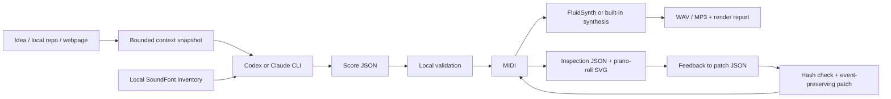

# Architecture and contracts

The CLI owns file writes, validation and rendering. Provider calls return data.
Provider output is never evaluated as Python or shell code. Filesystem paths for
artifacts are fixed by the CLI, not generated titles or model-supplied filenames.
The model sees bounded context with provenance and instrument inventory. Invalid
score/patch responses receive one repair attempt, then the run fails explicitly.

`--prepare` creates the same prompt/schema for an existing agent. `--response`,
`compile` and `apply` bypass provider calls, using exactly the same validation.
Every run has a fresh directory; failures preserve intermediate artifacts.

## Modules

| Module | Responsibility |
| --- | --- |
| `context.py` | Text/repo sampling, visible HTML, public URL checks |
| `agent.py` | Prompts and structured headless CLI adapters |
| `score.py` | JSON schemas, numeric validation, score compiler, MIDI patches |
| `midi.py` | Standard MIDI reader/writer, note/tempo analysis, SVG |
| `instruments.py` | Local SF2/SF3 preset discovery and sourcing guidance |
| `render.py` | Built-in synthesis, FluidSynth/FFmpeg export, measurements |
| `cli.py` | Commands, session history, reports and recovery artifacts |

## Units and preservation

Composition timing is in quarter-note beats; newly composed MIDI uses 480 PPQ.
Meter currently has a quarter-note denominator. MIDI pitch, program and channel
numbers are zero-based; channel 9 is percussion. Imported MIDI retains its own PPQ.
Every note has a track/event ID derived from its note-on event and the report's
source SHA256. Patch note properties are absolute resulting values, not deltas.
Tempo scaling multiplies all BPM segments and supplies the implicit default tempo
when necessary. It changes playback time without changing note ticks.

Opaque event payloads (including release velocity and SysEx) survive note edits.
Re-encoding produces canonical explicit channel statuses and stable event order
at equal ticks. End-of-track moves if notes extend the score. Simultaneous
same-pitch MIDI note pairing is inherently ambiguous and uses FIFO.

Patches target existing tracks. Program substitutions affect all program events
on a selected track/channel. MIDI channels carry shared state; a program edit
is rejected if another track uses that channel. Full bank/channel remapping,
controller edits, track insertion and symbolic harmony editing are future work.

## Scope and trust

This is a local CLI, not a multi-user service or security sandbox. Provider tools
are constrained by their launch flags, but provider/global configuration can
still affect behavior. Context filtering is bounded and excludes common secret
locations; it is not a DLP system. Public URL checks apply to each redirect,
but the CLI is not designed as a hostile-network fetch service. For stronger
isolation use an OS/container sandbox. Sources may be incomplete or misleading;
musical interpretation should say where assumptions were made.

The original prior project supplied the workflow lessons, not a required library.
The new composer is model-authored rather than a fixed prehistoric procedural
preset. Local synthesis and instrument advice are explicitly proxies. No sound
bank, model credential or third-party music is included in the source repository.
